# 🔋 Sampling-Based Extended Kalman Filter Hardware for Battery SOC Estimation

## 📌 프로젝트 개요

### 🔹 연구 배경
BMS(Battery Management System)는 배터리 상태를 모니터링하고 관리하여 안전성과 성능을 극대화하는 장점으로 전기자동차 및 스마트 기기에 주로 사용되고 있다. BMS는 배터리 상태뿐만 아니라 온도, 전압, 전류 등을 실시간 모니터링하고, 과충전, 과방전, 과열 등을 방지하며, 배터리 셀의 균형을 맞추는 역할을 한다. 하지만, 최근 전기자동차 폭발 사고의 원인으로 BMS가 지목되고 있다. BMS에서의 SOC 추정은 일반적으로 소프트웨어에서 처리되지만, 더 높은 안전성을 확보하기 위해 하드웨어 기반 EKF를 고안하였다. 하드웨어 설계를 통해 BMS의 과부하를 방지할 수 있다. 하드웨어 구현시 BMS의 면적이 커질 수밖에 없지만, 최소한으로 증가되도록 설계하고자 한다. 이를 통해 배터리의 안전성과 성능을 향상시켜서 전기자동차의 리튬이온 배터리 관리의 신뢰성을 높이고 사고 예방의 중요한 역할을 한다.

### 🎯 목적
소프트웨어 기반 확장 칼만 필터(EKF)와 하드웨어 구현 모델 간 배터리 SOC 추정 정확도를 비교 검증한다. 하드웨어에서는 고정소수점 연산과 truncation 기법을 적용하여 비트를 최소화하고 샘플링 간격을 조절해 면적과 전력 효율성을 최적화한다. 이를 통해 하드웨어 모델이 소프트웨어 모델과 1% 이내의 오차로 동일한 정확도를 유지하도록 설계한다. 최종적으로, 두 모델의 SOC 추정 정확도를 비교한 뒤 FPGA 보드와의 합성을 통해 동작을 검증하는 것을 목표로 한다. 

### ✨ 특징
- **샘플링 기법 적용**: SOC 수준에 따라 추정 주기를 1,000초 또는 100초 간격으로 조절 → 불필요한 전력 소모 감소  
- **고정소수점 연산 최적화**: Truncation 기법을 통해 RMSE 오차 최소화, 연산 비트수 최적화  
- **ALU 병렬 처리 구조**: `(A × B) + C` 형태 연산을 단일 연산 사이클에서 처리 → 연산 속도 향상 및 면적 절감  
- **하드웨어-소프트웨어 비교 검증**: Python 소프트웨어 모델과 하드웨어 RTL 시뮬레이션(VCS + Verdi)을 비교하여 SOC 추정 정확도 검증 (오차율 0.001417%)
- **FPGA 기반 실험 검증**: DE2-115 보드에서 구현된 하드웨어 SOC 추정 테스트, FND를 통해 충·방전 시 SOC 값 실시간 확인

---

## 🛠 설계 및 구현

### 🔹 EKF 알고리즘 개요
- 1차 등가회로와 배터리 모델 EKF를 이용하여 배터리 SOC를 추정하기 위해 Samsung사의 INR21700-50E인 리튬이온 배터리를 사용

> Samsung INR21700-50E의 주요 사양

- 보통 배터리 SOC 추정을 할 때 사용하는 회로는 1차 등가회로(ECM)를 주로 사용한다. ⓐ에서는 각각 단자 전압, 배터리 전류, 내부 저항, RC래더의 저항과 커패시터, 저항과 커패시터 사이에 걸리는 전압이다. ⓑ는 배터리의 사양을 가지고 단일 펄스 전류 방전 테스트를 통해 배터리 전류와 단자 전압을 MATLAB을 통해 나타낸 것이다.
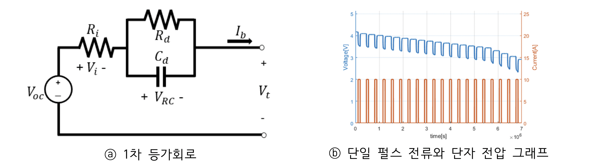
> 1차 등가회로와 단일 펄스 전류와 단자 전압 그래프

- 알고리즘 구현 
배터리 SOC를 추정하는 기존 EKF 알고리즘은 ⓐ와 같다. 초깃값 선정, SOC와  VRC, 오차 공분산과 단자 전압 예측, 칼만 이득 계산, SOC와  VRC, 오차 공분산 추정 과정을 반복한다. 본 설계에서 제안하는 배터리 SOC 추정 알고리즘인 ⓑ에서는 ⓐ에서 추정되는 SOC에 따라 샘플링 간격을 조절한 뒤 반복한다.
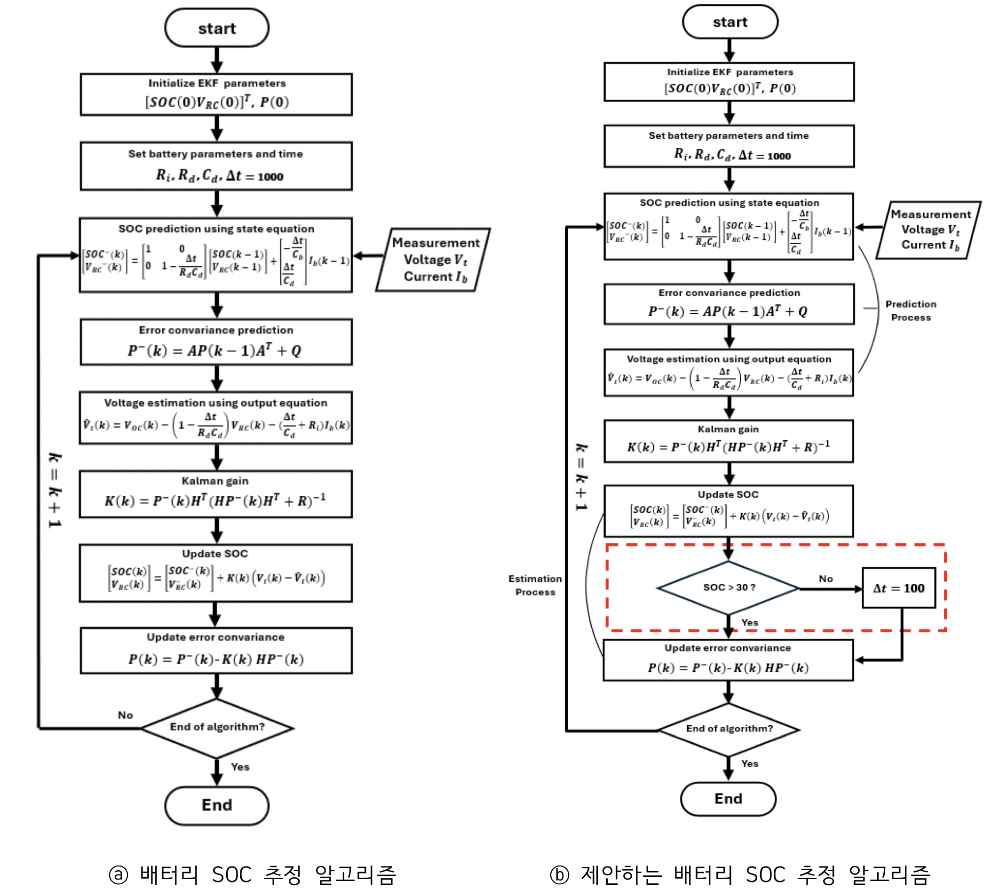
> 배터리 SOC 추정 EKF 알고리즘과 제안하는 배터리 SOC EKF 알고리즘

- 초깃값 선정 
기본적인 EKF의 상태공간 방정식에 배터리 SOC를 추정하는 과정을 대입하여 상태 공간 모델의 값을 선정한다. A, B는 SOC 상태 추정을 위한 시스템 행렬이며 H, D는 SOC와 전압 간의 관계를 나타내는 출력 행렬이다. Q와 R은 시스템 잡음, 측정 잡음이다.
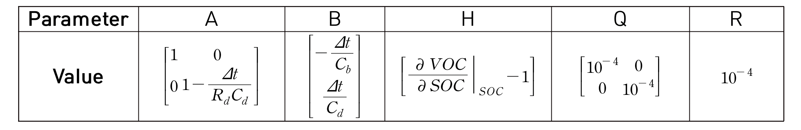
> 상태 공간 모델

- 예측 과정 
예측 과정에서는 상태공간 방정식을 활용하여 SOC, RC 래더 전압의 추정값과 오차 공분산, 단자 전압의 예측값을 계산한다.

- 칼만 이득 계산 과정 
칼만 이득 계산은 SOC를 추정할 때 가중치의 역할을 하는 칼만 이득을 계산한다.

- 추정 과정 
추정 과정은 추정값과 오차공분산을 계산한다. 이 과정에서 SOC 추정값이 계산되고 계산된 값들은 다음 예측 과정에서 사용한다.

- 샘플링 간격 조절 
제안하는 배터리 SOC 추정 알고리즘에서 샘플링 간격을 조절하는 것을 알 수 있다. 하드웨어 구현 시 충·방전할 때 1초마다 700,000번을 추정하는 것이 불필요한 전력 소모라고 판단하여 다음과 같이 진행한다. 충전 시 추정되는 SOC가 70% 이하일 때는 1,000초 간격, 70%보다 높을 때는 과충전 방지를 위해 100초 간격으로 추정한다. 방전 시에는 30% 이상일 때 1,000초 간격, 30%보다 낮을 때는 100초 간격으로 추정한다.

### 🔹 설계 회로 구성
- **소프트웨어 모델 구현** 
하드웨어 구현에 앞서 소프트웨어 모델을 구현한 후 이를 바탕으로 하드웨어 설계를 진행한다. BMS에서 일부 시스템에 불과한 SOC 추정 과정을 하드웨어로 구현하는 것이기 때문에 하드웨어의 면적과 속도를 고려하여 고정소수점 연산을 사용한다. 고정소수점 연산을 사용하기 위해 하드웨어 비트 선정을 소프트웨어 모델에서 truncation 기법을 사용해 RMSE 값이 커지지 않는 범위 내에서 최적의 비트를 선정했다. 그림 4)을 보면 24bit에서 23bit으로 줄일 때 정확도가 급격히 떨어지기 때문에 변수들을 24bit로 선정했다. 소프트웨어 모델에서 각 변수들의 최소값과 최대값을 구하고 이에 따라 각 변수들에 대하여 부호(sign) 1 bit, 정수부(integer) n bit, 소수부(fraction) 24 – 1 – n bit로 할당한다.
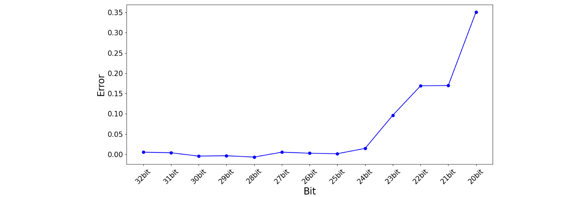
> bit별 RMSE Error 그래프

- **시스템 구조** 
EKF를 이용한 SOC 배터리를 추정하는 하드웨어 블록도이다. 이 블록도는 앞서 설명한 제안한 알고리즘을 바탕으로 구현하였다. 
  - **모듈별 역할**:
    - `INIT_EKF`: EKF 파라미터 초기값 설정
    - `IB_ROM`, `VT_ROM`: 전류(Ib)와 단자 전압(Vt) 데이터를 저장하고 필요 시 입력으로 제공 (실제 시스템에서는 실시간 측정값 사용)
    - 메모리 모듈: 전체 모듈 검증용, 실제 적용 시 불필요
  - **연산 처리**:
    - **덧셈**: 정수부가 큰 변수 기준으로 다른 변수 부호 확장, 결과 오버플로우 방지 위해 정수부 1비트 추가
    - **곱셈**: 절댓값 곱 후 부호 비교로 최종 결과 결정, 1클럭 소요
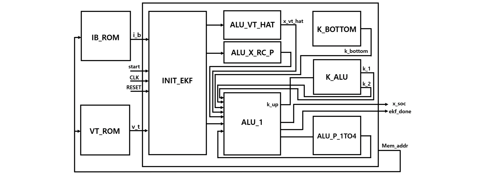
> EKF Hardware Block Diagram

- **Timing Diagram** 
하드웨어의 전체적인 동작 순서를 나타내는 타이밍 다이어그램이다. 기존 EKF는 예측 단계에서 상태와 공분산을 예측하고, 업데이트 단계에서 측정값을 사용하여 상태와 공분산을 업데이트하는 순으로 동작한다. 하지만, 본 설계에서는 EKF의 예측과 업데이트 단계에서 동시에 처리할 수 있는 부분들을 병렬적으로 처리하여 동작 시간을 단축시킨다. 순차적으로 동작시키기 위해 FSM(Finite-State-Machine)기법을 사용한다. step 2부터 6까지 5개의 state를 사용하여 SOC를 추정한다. 이러한 동작을 2455번 반복하여 방전될 때는 100%에서 0%로, 충전할 때는 0%에서 100%로 설계한다.
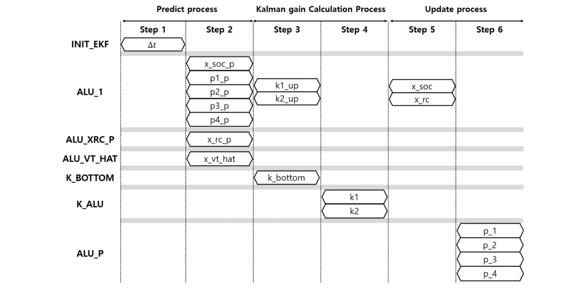
> Timing Diagram

- **ALU_1** 
ALU_1 모듈에 대한 블록도와 변수들을 나타낸 표이다. 표의 Latency는 각 수식의 계산 순서이며 step 2, 3, 5에 해당한다. 모듈에서는 여러 단계를 Latency에 따라 병렬적으로 처리한다. SOC와 의 추정값 및 예측값, 오차 공분산의 추정값을 계산하는 수식들을 정리하면 (A x B) + C 형태의 수식을 갖는다. 이러한 공통점을 기반으로, ALU_1 모듈에서 단일 연산 사이클 내에서 여러 수식을 효율적으로 처리할 수 있는 구조를 설계. 이러한 방식을 통해 전체 시스템의 연산 속도를 향상시키고, 여러 수식을 스케줄링을 통해 하나의 모듈에서 처리하기 때문에 하드웨어 면적이 줄어든다는 장점을 갖는다. 제안한 알고리즘에 있는 행렬 식들을 스칼라 방식으로 전개한 후 수식을 정리하여 행렬요소 중 0인 부분을 제거하여, 연산량이 감소되기 때문에 연산 처리 속도를 높일 수 있다는 장점을 갖는다.
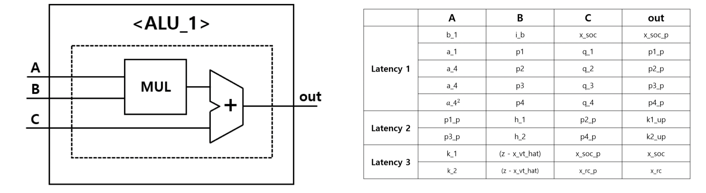
> ALU_1

- **그 외 modules** 
ALU_1을 제외한 나머지 모듈이다. ALU_X_RC_P는 RC-래더의 예측전압을 구한다. ALU_X_VT_HAT는 이전 SOC를 이용하여 다음 예측 단자 전압을 구한다. 
K_BOTTOM과 K_ALU는 칼만 이득을 스칼라 방식으로 전개하여 복잡해진 수식을 나누어 구하는 데 사용한다. K_ALU의 모듈은 48비트로 데이터를 받아 나눗셈한다. 모델의 정확성을 높이기 위해 더 많은 비트를 사용하여 소수부의 정밀도를 높이기 위해, 다른 연산들과 달리 48비트로 비트 확장을 진행하는 비복원 나눗셈(Non-restoring division)을 구현한다. 이 나눗셈 알고리즘은 고정소수점 나눗셈에서 높은 정밀도를 유지하기 위해 사용되며, 48비트 연산을 통해 연산의 정확성을 높이고 24비트로 잘라서 결과로 내보낸다. 나눗셈 연산 시 48비트의 연산으로 인해 48 클럭이 소요된다.
ALU_P는 오차 공분산의 추정값을 계산한다. 2x2 행렬의 구조를 가진 오차 공분산의 행렬 연산을 스칼라 방식으로 풀어 p1, p2, p3, p4로 나눠서 진행하였다.

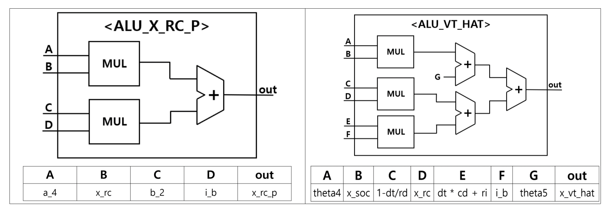
> ALU_X_RC_P 와 ALU_VT_HAT의 Block diagram

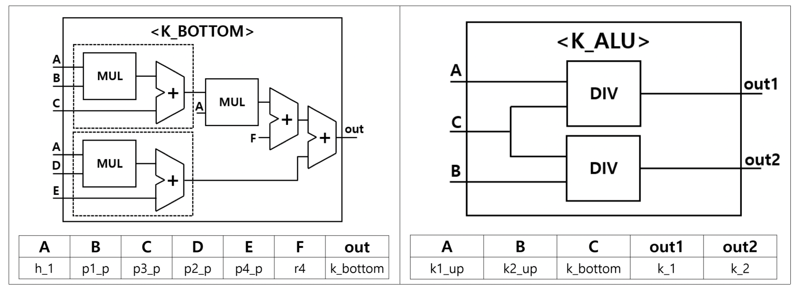
> K_BOTTOM과 K_ALU의 Block diagram

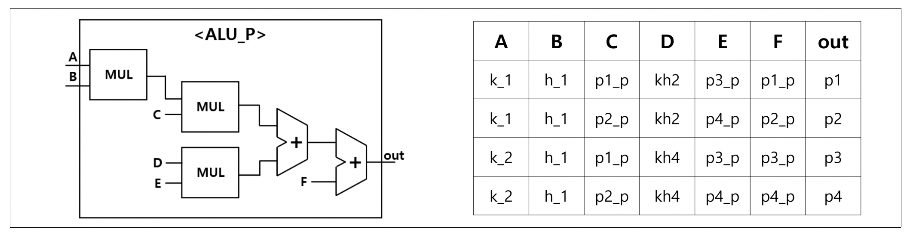
> ALU_P의 Block diagram 

## 📊 실험 및 검증 (Verification & Results)

### 🔹 설계 회로 검증
- 전체적인 회로 검증 과정이다. VerilogHDL로 RTL 설계를 진행한 후 기능 검증을 위해 소프트웨어 모델에서 전류와 단자 전압을 추출한 뒤 메모리에 저장한다. Top 모듈에 메모리를 연결시키고, testbench를 작성한 후 VCS로 컴파일을 진행한다. 그리고 Verdi tool을 이용하여 simulation을 통해 검증하였다.
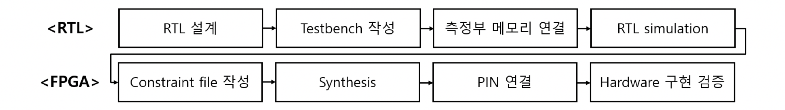
> 하드웨어 검증 과정

- 시각적으로 보기 위해 추정된 SOC를 Analog 신호로 변환하여 파형을 본 결과이다. 

> Simulation Result

### 🔹 하드웨어-소프트웨어 비교
구현한 하드웨어는 소프트웨어 모델을 기반으로 진행하였기 때문에 하드웨어에서 추정한 SOC 데이터를 추출한 값과 소프트웨어 모델의 SOC 추정값을 Python에서 비교하였다. 소프트웨어와 하드웨어 모델을 나타낸 그래프와, 두 모델의 정확도를 RMSE 방식으로 비교한 결과이다. 결과적으로, 0.001417% 미세한 오차가 발생한 것을 알 수 있다. 이러한 오차는 하드웨어 구현 과정에서 비트를 최적화하여 구현하였기 때문에 소수점 이하의 마지막 비트들이 일부 잘리는 현상으로 인해 발생하였다.
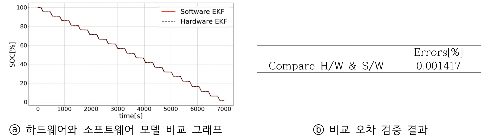
> Hardware와 Software 모델 비교 및 오차(RMSE) 검증

### 🔹 설계 회로 구현 결과
- Verdi tool을 이용하여 확인한 최상위 모듈에 대한 Schematic이다. 이를 통해 계획한 블록도가 Schematic에 올바르게 구현된 것을 확인하였다.
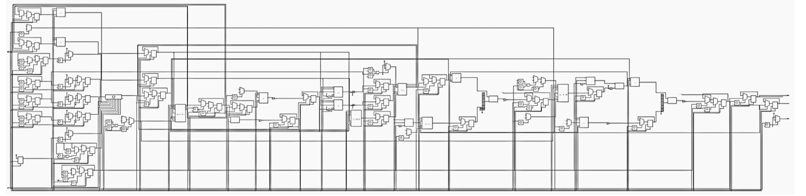
> RTL-Designed Hardware Schematic

- Quartus prime 20.1버전에서 DE2-115 보드와 합성을 진행하였다. 이를 통해 합성 결과인 표를 통해 FPGA와의 합성이 잘 된 것을 확인할 수 있었다
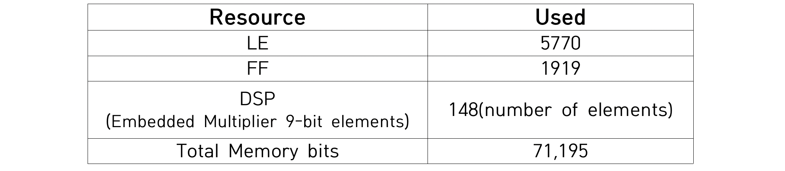
> FPGA board synthesis result

- clock 주기를 40 ns로 설정하였을 때, Setup에 대한 slack이 13.764 ns가 되었다. 설계한 하드웨어는 25 MHz 클럭으로 동작이 가능하며, 최대 38.12 MHz 클럭으로 동작 가능할 것으로 기대된다.

> Timing Summary

### 🔹 FPGA 보드 동작
- DE2-115 보드와의 합성한 결과이다. 실제 구현 시 700,000초(=194시간)를 기다려야 충·방전이 된다. 오랜 시간이 소요되기 때문에 보드와의 검증을 진행하기 위해 샘플링 데이터를 입력 받는 시간을 5분 이내로 충·방전되게 설정하여 검증하였다. 
FPGA와 합성하였을 때 보드에서 동작하는 한 장면이다. 추정된 SOC를 표현하기 위해 SOC의 정수부를 FND로 나타내기 위해 FND와 연결하여 구현하였다. FND에 추정된 SOC값이 나타나고 있는 것을 알 수 있다.
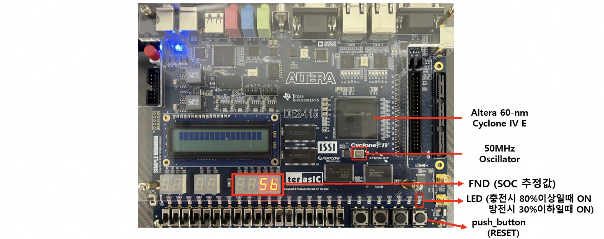
> DE2-115 Board 동작

### 🔹 결과
- 소프트웨어 모델과 하드웨어 모델의 추정값 비교하면 동일하게 나올 것이라고 예상하였지만 0.001417% 미세한 오차가 발생하였다. 다음과 같은 문제는 앞서 설계 회로 검증 부분에서 설명한 바와 같이 하드웨어 구현 과정에서 비트를 최적화하여 구현하였기 때문에 소수점 이하의 마지막 비트들이 일부 잘리는 현상으로 인해 발생한 것이다. 
이러한 문제를 해결하려면 변수들의 비트 수를 확장하면 오차는 줄어든다. 하지만 이렇게 할 경우, 사용된 변수들 전체를 비트 확장해야 하므로 전력 소모와 자원 사용 측면에서 비효율적일 뿐만 아니라, 하드웨어의 복잡성과 비용 또한 증가하게 된다. 결과적으로, 이러한 해결방안은 하드웨어의 효율성을 저하시키며, 0.001417%의 오차는 시스템의 성능에 큰 영향을 주지 않기 때문에 적용하지 않았다.

---